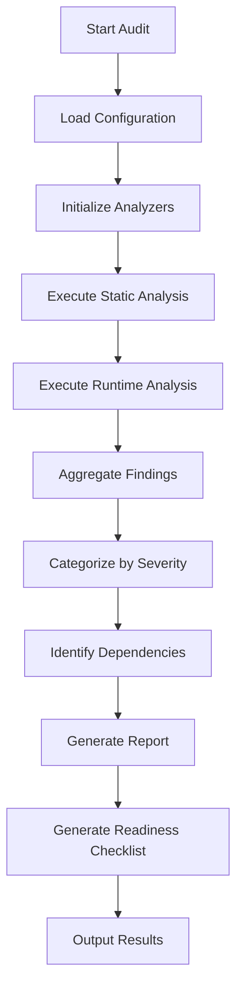

# Design Document: Comprehensive System Audit for TradePartners Options Trading Platform

## Overview

This design specifies a systematic audit methodology for the TradePartners simulated options trading platform. The audit examines the complete trade pipeline from webhook signal ingestion through trade finalization, identifying issues that could prevent profitable real-money trading.

The audit is implemented as an automated analysis tool that:
- Systematically examines every component in the trade pipeline
- Categorizes findings by severity (Critical/High/Medium/Low)
- Produces a structured report with actionable recommendations
- Generates a profitability readiness checklist

The audit covers 20 requirement areas spanning signal processing, decision logic, risk management, market data, state management, exit monitoring, adaptive intelligence, backtesting, error handling, database integrity, configuration, performance tracking, and testing coverage.

### Audit Scope

The audit examines these critical system components:

**Signal Processing Layer**
- Webhook ingestion and validation (`backend/src/modules/webhooks/`)
- Signal normalization and parsing (`backend/src/modules/webhooks/normalizers/`)
- Signal prioritization and queuing (`backend/src/modules/sim/signal-prioritizer.js`)

**Decision and Risk Layer**
- Trade decision engine (`backend/src/modules/sim/trade-decision-engine.js`)
- Decision routing and guard evaluation (`backend/src/modules/sim/decision-router.js`)
- Safety guards and risk management (`backend/src/modules/sim/safety-guards.js`, `adaptive-guards.js`)
- Risk scaling and position sizing (`backend/src/modules/sim/risk-scaler.js`)
- Expected move filtering (`backend/src/modules/sim/expected-move-filter.js`)

**Execution Layer**
- Options construction and pricing (`backend/src/modules/sim/options-constructor.service.js`)
- Trade execution (`backend/src/modules/sim/executor.js`)
- Market intelligence and confluence (`backend/src/modules/sim/market-intelligence.js`)

**State Management Layer**
- Ledger and cash tracking (`backend/src/modules/sim/ledger.service.js`)
- Symbol state management (`backend/src/modules/sim/symbol-state.service.js`)
- Position tracking and updates

**Exit and Finalization Layer**
- Exit monitoring (`backend/src/modules/sim/exit-monitor.js`)
- Trade finalization and P&L (`backend/src/modules/sim/trade-finalizer.js`)
- Strategy scorecard (`backend/src/modules/sim/strategy-scorecard.service.js`)

**Adaptive Intelligence Layer**
- Conviction calibration (`backend/src/modules/sim/adaptive-intelligence/`)
- Temporal edge analysis
- Signal quality tracking
- Guard effectiveness monitoring

**Market Data Layer**
- Data providers (`data-service/src/providers/`)
- Circuit breakers and failover (`data-service/src/services/circuit-breaker.ts`)
- Rate limiting (`data-service/src/services/rate-limiter.ts`)
- Data pollers (`data-service/src/workers/`)

**Backtesting Layer**
- Replay service (`backend/src/modules/sim/replay.service.js`)
- Historical data handling

## Architecture

### Audit Tool Architecture

The audit system is designed as a standalone analysis tool that can be run on-demand or as part of CI/CD pipelines.

```
┌─────────────────────────────────────────────────────────────┐
│                     Audit Orchestrator                       │
│  - Coordinates audit execution across all requirement areas  │
│  - Aggregates findings from all analyzers                    │
│  - Generates final report and readiness checklist            │
└─────────────────────────────────────────────────────────────┘
                              │
                              ▼
┌─────────────────────────────────────────────────────────────┐
│                    Analyzer Registry                         │
│  - Registers 20 specialized analyzers (one per requirement)  │
│  - Manages analyzer lifecycle and dependencies               │
└─────────────────────────────────────────────────────────────┘
                              │
                              ▼
        ┌─────────────────────┴─────────────────────┐
        │                                             │
        ▼                                             ▼
┌──────────────────┐                      ┌──────────────────┐
│ Static Analyzers │                      │ Runtime Analyzers│
│                  │                      │                  │
│ - AST parsing    │                      │ - Test execution │
│ - Pattern match  │                      │ - Integration    │
│ - Code structure │                      │ - Property tests │
└──────────────────┘                      └──────────────────┘
        │                                             │
        └─────────────────────┬─────────────────────┘
                              ▼
┌─────────────────────────────────────────────────────────────┐
│                    Finding Aggregator                        │
│  - Collects findings from all analyzers                      │
│  - Deduplicates and categorizes by severity                  │
│  - Identifies dependencies between findings                  │
└─────────────────────────────────────────────────────────────┘
                              │
                              ▼
┌─────────────────────────────────────────────────────────────┐
│                    Report Generator                          │
│  - Produces structured markdown report                       │
│  - Generates profitability readiness checklist               │
│  - Creates summary dashboard                                 │
└─────────────────────────────────────────────────────────────┘
```

### Audit Execution Flow



### Analyzer Types

**Static Analyzers**: Examine source code without execution
- AST parsing for code structure analysis
- Pattern matching for common anti-patterns
- Import/dependency analysis
- Dead code detection
- Error handling coverage analysis

**Runtime Analyzers**: Execute code to verify behavior
- Integration test execution
- Property-based test execution
- Database schema validation
- Configuration validation
- Performance profiling

**Hybrid Analyzers**: Combine static and runtime analysis
- Test coverage analysis (static + runtime)
- Guard effectiveness (static rules + runtime behavior)
- Data flow analysis (static paths + runtime values)

## Components and Interfaces

### Core Components

#### 1. AuditOrchestrator

The main entry point that coordinates the entire audit process.

```javascript
class AuditOrchestrator {
  constructor(config) {
    this.config = config;
    this.registry = new AnalyzerRegistry();
    this.findings = [];
  }

  async runAudit() {
    // Initialize all analyzers
    await this.registry.initializeAnalyzers();
    
    // Execute static analysis phase
    const staticFindings = await this.runStaticAnalysis();
    
    // Execute runtime analysis phase
    const runtimeFindings = await this.runRuntimeAnalysis();
    
    // Aggregate and categorize findings
    this.findings = this.aggregateFindings(staticFindings, runtimeFindings);
    
    // Generate report
    const report = await this.generateReport();
    
    // Generate readiness checklist
    const checklist = await this.generateReadinessChecklist();
    
    return { report, checklist, findings: this.findings };
  }

  async runStaticAnalysis() {
    const analyzers = this.registry.getStaticAnalyzers();
    const findings = [];
    
    for (const analyzer of analyzers) {
      const result = await analyzer.analyze();
      findings.push(...result.findings);
    }
    
    return findings;
  }

  async runRuntimeAnalysis() {
    const analyzers = this.registry.getRuntimeAnalyzers();
    const findings = [];
    
    for (const analyzer of analyzers) {
      const result = await analyzer.analyze();
      findings.push(...result.findings);
    }
    
    return findings;
  }
}
```

#### 2. BaseAnalyzer

Abstract base class that all specialized analyzers extend.

```javascript
class BaseAnalyzer {
  constructor(config) {
    this.config = config;
    this.findings = [];
  }

  // Template method - subclasses implement specific analysis
  async analyze() {
    throw new Error('Subclasses must implement analyze()');
  }

  // Helper to add findings with consistent structure
  addFinding(finding) {
    this.findings.push({
      id: this.generateFindingId(),
      analyzer: this.constructor.name,
      severity: finding.severity, // Critical, High, Medium, Low
      category: finding.category, // Critical Blocker, Logic Flaw, etc.
      title: finding.title,
      description: finding.description,
      impact: finding.impact,
      location: finding.location, // { file, line, function }
      recommendation: finding.recommendation,
      effort: finding.effort, // hours or story points
      dependencies: finding.dependencies || [], // other finding IDs
      timestamp: new Date().toISOString()
    });
  }

  generateFindingId() {
    return `${this.constructor.name}-${this.findings.length + 1}`;
  }
}
```

#### 3. Specialized Analyzers

Each of the 20 requirement areas has a dedicated analyzer:

```javascript
// Example: Signal Normalization Analyzer
class SignalNormalizationAnalyzer extends BaseAnalyzer {
  async analyze() {
    // Check all normalizers in backend/src/modules/webhooks/normalizers/
    const normalizers = await this.findNormalizers();
    
    for (const normalizer of normalizers) {
      await this.checkRequiredFields(normalizer);
      await this.checkErrorHandling(normalizer);
      await this.checkTimezoneHandling(normalizer);
      await this.checkContractCompliance(normalizer);
      await this.checkRoundTripProperty(normalizer);
    }
    
    return { findings: this.findings };
  }

  async checkRequiredFields(normalizer) {
    const ast = await this.parseFile(normalizer.path);
    const requiredFields = ['symbol', 'direction', 'conviction', 'timestamp'];
    
    // Check if normalizer validates all required fields
    for (const field of requiredFields) {
      if (!this.hasFieldValidation(ast, field)) {
        this.addFinding({
          severity: 'High',
          category: 'Data Integrity Issue',
          title: `Missing validation for required field: ${field}`,
          description: `Normalizer ${normalizer.name} does not validate required field '${field}'`,
          impact: 'Invalid signals could enter the trade pipeline, causing downstream failures',
          location: { file: normalizer.path, line: null, function: 'normalize' },
          recommendation: `Add validation to ensure '${field}' is present and valid`,
          effort: 2
        });
      }
    }
  }
}

// Example: Decision Engine Logic Analyzer
class DecisionEngineAnalyzer extends BaseAnalyzer {
  async analyze() {
    const enginePath = 'backend/src/modules/sim/trade-decision-engine.js';
    const ast = await this.parseFile(enginePath);
    
    await this.checkConvictionConsistency(ast);
    await this.checkContradictoryRules(ast);
    await this.checkStrikeSelection(ast);
    await this.checkDTEBounds(ast);
    await this.checkExitRuleCalculations(ast);
    await this.checkUndefinedParameters(ast);
    
    return { findings: this.findings };
  }

  async checkContradictoryRules(ast) {
    // Analyze decision logic for contradictory conditions
    const rules = this.extractDecisionRules(ast);
    
    for (let i = 0; i < rules.length; i++) {
      for (let j = i + 1; j < rules.length; j++) {
        if (this.rulesContradict(rules[i], rules[j])) {
          this.addFinding({
            severity: 'Critical',
            category: 'Logic Flaw',
            title: 'Contradictory decision rules detected',
            description: `Rules at lines ${rules[i].line} and ${rules[j].line} can produce conflicting decisions`,
            impact: 'Unpredictable trade decisions that could lead to losses',
            location: { file: enginePath, line: rules[i].line, function: 'makeDecision' },
            recommendation: 'Refactor rules to ensure mutual exclusivity or define precedence',
            effort: 8
          });
        }
      }
    }
  }
}

// Example: Safety Guard Analyzer
class SafetyGuardAnalyzer extends BaseAnalyzer {
  async analyze() {
    const guardPath = 'backend/src/modules/sim/safety-guards.js';
    const routerPath = 'backend/src/modules/sim/decision-router.js';
    
    await this.checkMaxLossCalculation(guardPath);
    await this.checkPositionLimits(guardPath);
    await this.checkCooldownTracking(guardPath);
    await this.checkRaceConditions(guardPath, routerPath);
    await this.checkGuardLogging(guardPath);
    await this.checkGuardEvaluationOrder(routerPath);
    
    return { findings: this.findings };
  }

  async checkRaceConditions(guardPath, routerPath) {
    // Analyze for potential race conditions in guard evaluation
    const guardAst = await this.parseFile(guardPath);
    const routerAst = await this.parseFile(routerPath);
    
    // Check if position limit checks are atomic
    if (!this.hasAtomicPositionCheck(guardAst)) {
      this.addFinding({
        severity: 'Critical',
        category: 'Robustness Gap',
        title: 'Race condition in position limit guard',
        description: 'Multiple concurrent signals could bypass position limits due to non-atomic check-and-increment',
        impact: 'System could exceed maximum position limits, increasing risk exposure',
        location: { file: guardPath, line: null, function: 'checkPositionLimit' },
        recommendation: 'Use database transactions or locks to ensure atomic position limit checks',
        effort: 16
      });
    }
  }
}
```

#### 4. FindingAggregator

Collects and processes findings from all analyzers.

```javascript
class FindingAggregator {
  constructor() {
    this.findings = [];
  }

  addFindings(findings) {
    this.findings.push(...findings);
  }

  categorize() {
    return {
      critical: this.findings.filter(f => f.severity === 'Critical'),
      high: this.findings.filter(f => f.severity === 'High'),
      medium: this.findings.filter(f => f.severity === 'Medium'),
      low: this.findings.filter(f => f.severity === 'Low')
    };
  }

  groupByCategory() {
    const categories = {};
    for (const finding of this.findings) {
      if (!categories[finding.category]) {
        categories[finding.category] = [];
      }
      categories[finding.category].push(finding);
    }
    return categories;
  }

  identifyDependencies() {
    // Build dependency graph between findings
    const graph = new Map();
    
    for (const finding of this.findings) {
      if (finding.dependencies && finding.dependencies.length > 0) {
        graph.set(finding.id, finding.dependencies);
      }
    }
    
    return graph;
  }

  deduplicate() {
    // Remove duplicate findings based on location and description
    const seen = new Set();
    const unique = [];
    
    for (const finding of this.findings) {
      const key = `${finding.location.file}:${finding.location.line}:${finding.title}`;
      if (!seen.has(key)) {
        seen.add(key);
        unique.push(finding);
      }
    }
    
    this.findings = unique;
  }
}
```

#### 5. ReportGenerator

Produces the final audit report and readiness checklist.

```javascript
class ReportGenerator {
  constructor(findings, config) {
    this.findings = findings;
    this.config = config;
  }

  async generateReport() {
    const report = {
      metadata: this.generateMetadata(),
      summary: this.generateSummary(),
      dashboard: this.generateDashboard(),
      findings: this.generateFindingsSection(),
      readinessChecklist: this.generateReadinessChecklist()
    };
    
    return this.formatAsMarkdown(report);
  }

  generateSummary() {
    const categorized = this.categorizeFindings();
    
    return {
      totalFindings: this.findings.length,
      critical: categorized.critical.length,
      high: categorized.high.length,
      medium: categorized.medium.length,
      low: categorized.low.length,
      estimatedEffort: this.calculateTotalEffort(),
      topIssues: this.getTopIssues(5)
    };
  }

  generateDashboard() {
    const byCategory = this.groupByCategory();
    const bySeverity = this.categorizeFindings();
    
    return {
      findingsByCategory: Object.keys(byCategory).map(cat => ({
        category: cat,
        count: byCategory[cat].length,
        critical: byCategory[cat].filter(f => f.severity === 'Critical').length
      })),
      findingsBySeverity: {
        critical: bySeverity.critical.length,
        high: bySeverity.high.length,
        medium: bySeverity.medium.length,
        low: bySeverity.low.length
      },
      componentHealth: this.assessComponentHealth()
    };
  }

  generateReadinessChecklist() {
    return {
      backtest: this.generateBacktestChecklist(),
      dataQuality: this.generateDataQualityChecklist(),
      guards: this.generateGuardChecklist(),
      positionSizing: this.generatePositionSizingChecklist(),
      paperTrading: this.generatePaperTradingChecklist(),
      monitoring: this.generateMonitoringChecklist(),
      incidentResponse: this.generateIncidentResponseChecklist(),
      compliance: this.generateComplianceChecklist()
    };
  }
}
```

### Analyzer Implementations

Each of the 20 requirement areas requires a specialized analyzer. Here are the key analysis techniques for each:

#### Signal Ingestion and Normalization (Req 1)
- **Static Analysis**: Parse normalizer files, check for required field validation
- **Pattern Matching**: Identify missing error handlers, hardcoded assumptions
- **Contract Validation**: Verify output conforms to signal.contract.js
- **Property Testing**: Verify round-trip property (parse → serialize → parse)

#### Decision Engine Logic (Req 2)
- **AST Analysis**: Extract decision rules and check for contradictions
- **Formula Validation**: Verify conviction scoring formulas are consistent
- **Bounds Checking**: Verify DTE and strike selection respect configured limits
- **Null Safety**: Identify paths where parameters could be undefined

#### Safety and Risk Guards (Req 3)
- **Concurrency Analysis**: Identify potential race conditions in guard evaluation
- **State Tracking**: Verify guards correctly track cumulative state
- **Evaluation Order**: Verify guard evaluation order is deterministic
- **Logging Coverage**: Ensure all guard blocks are logged

#### Options Construction (Req 4)
- **Data Flow Analysis**: Verify options chain data flows correctly
- **Fallback Logic**: Check for missing data fallback handling
- **Pricing Validation**: Verify bid-ask spreads are realistic
- **Greeks Validation**: Ensure Greeks are present and not stale

#### Market Data Pipeline (Req 5)
- **Circuit Breaker Testing**: Verify circuit breakers trigger correctly
- **Failover Testing**: Verify provider failover works
- **Staleness Detection**: Check for stale data detection
- **Rate Limit Testing**: Verify rate limiting prevents quota exhaustion

#### State Management (Req 6)
- **Transaction Analysis**: Verify ledger operations are atomic
- **Consistency Checking**: Verify cash and position state consistency
- **Orphan Detection**: Identify potential for orphaned records
- **Audit Trail**: Verify all state changes are logged

#### Exit Monitoring (Req 7)
- **Logic Verification**: Verify stop-loss and take-profit calculations
- **Timing Analysis**: Check for missed position updates
- **P&L Validation**: Verify P&L includes all fees and commissions
- **Cleanup Verification**: Verify closed positions are removed from monitoring

#### Adaptive Intelligence (Req 8)
- **Algorithm Analysis**: Check for divergence or invalid parameters
- **Data Sufficiency**: Verify safe defaults when data is insufficient
- **Persistence Verification**: Verify calibration data survives restarts
- **Effectiveness Tracking**: Verify guard effectiveness is tracked correctly

#### Replay and Backtesting (Req 9)
- **Code Path Comparison**: Identify differences between replay and live mode
- **Look-ahead Bias**: Verify point-in-time data usage
- **State Consistency**: Verify guard states are maintained correctly
- **Result Validation**: Compare replay results with live results

#### Error Handling (Req 10)
- **Exception Coverage**: Identify try-catch blocks without logging
- **Async Error Handling**: Identify async operations without error handlers
- **Silent Failure Detection**: Find operations that could fail silently
- **Alert Verification**: Verify critical errors trigger alerts

#### Database Schema (Req 11)
- **Schema Analysis**: Verify foreign keys, constraints, indexes
- **Precision Checking**: Verify monetary fields use DECIMAL
- **Cascade Analysis**: Identify missing cascade deletes
- **Migration Testing**: Verify migrations are reversible

#### Configuration (Req 12)
- **Environment Variable Audit**: Verify no hardcoded secrets
- **Mode Separation**: Verify sim/live mode separation
- **Validation Coverage**: Verify all config values are validated
- **Documentation**: Verify all env vars are documented

#### Risk Scaling (Req 13)
- **Formula Validation**: Verify risk scaling formulas
- **Edge Case Handling**: Verify handling of missing volatility data
- **Bounds Checking**: Verify position sizes respect limits
- **Expected Move Calculation**: Verify expected move uses correct time horizons

#### Performance Tracking (Req 14)
- **Metric Validation**: Verify scorecard calculations are correct
- **Atomicity**: Verify metrics update atomically with trades
- **Edge Case Handling**: Verify handling of zero trades/variance
- **Query Performance**: Verify scorecard queries are efficient

#### Market Intelligence (Req 15)
- **Aggregation Logic**: Verify market intelligence aggregates correctly
- **Weight Normalization**: Verify confluence weights are normalized
- **Missing Data Handling**: Verify graceful handling of missing data
- **Conflict Resolution**: Verify handling when providers disagree

#### Profitability Readiness (Req 16)
- **Threshold Definition**: Define minimum performance thresholds
- **Checklist Generation**: Generate comprehensive readiness checklist
- **Metric Tracking**: Define key metrics to monitor
- **Procedure Documentation**: Document incident response procedures

#### Report Generation (Req 17)
- **Categorization**: Categorize findings by severity and category
- **Prioritization**: Prioritize findings by impact and effort
- **Dependency Tracking**: Identify dependencies between findings
- **Effort Estimation**: Estimate effort to fix each finding

#### Signal Prioritization (Req 18)
- **Ranking Logic**: Verify signal ranking is correct
- **Queue Management**: Verify queue doesn't drop signals
- **Race Condition Analysis**: Identify race conditions in prioritization
- **Staleness Checking**: Verify stale signals are rejected

#### Webhook Processing (Req 19)
- **Security Analysis**: Verify webhook signature validation
- **Rate Limiting**: Verify rate limiting prevents DoS
- **Payload Validation**: Verify payload size limits
- **Idempotency**: Verify webhook processing is idempotent

#### Integration Testing (Req 20)
- **Coverage Analysis**: Identify untested critical paths
- **Mock Analysis**: Identify over-mocked tests
- **Test Data Quality**: Verify tests use realistic data
- **Flakiness Detection**: Identify flaky or timing-dependent tests

## Data Models

### Finding Model

```javascript
{
  id: string,                    // Unique identifier
  analyzer: string,              // Name of analyzer that found it
  severity: 'Critical' | 'High' | 'Medium' | 'Low',
  category: 'Critical Blocker' | 'Logic Flaw' | 'Missing Functionality' | 
            'Robustness Gap' | 'Data Integrity Issue' | 'Observability Gap',
  title: string,                 // Short description
  description: string,           // Detailed description
  impact: string,                // Impact on profitability/reliability
  location: {
    file: string,                // File path
    line: number | null,         // Line number (null if file-level)
    function: string | null      // Function name
  },
  recommendation: string,        // How to fix
  effort: number,                // Estimated hours or story points
  dependencies: string[],        // IDs of findings that must be fixed first
  timestamp: string              // ISO 8601 timestamp
}
```

### Audit Report Model

```javascript
{
  metadata: {
    auditDate: string,           // ISO 8601 timestamp
    auditVersion: string,        // Audit tool version
    codebaseCommit: string,      // Git commit hash
    duration: number             // Audit duration in seconds
  },
  summary: {
    totalFindings: number,
    critical: number,
    high: number,
    medium: number,
    low: number,
    estimatedEffort: number,     // Total hours to fix all findings
    topIssues: Finding[]         // Top 5 most critical findings
  },
  dashboard: {
    findingsByCategory: Array<{
      category: string,
      count: number,
      critical: number
    }>,
    findingsBySeverity: {
      critical: number,
      high: number,
      medium: number,
      low: number
    },
    componentHealth: Array<{
      component: string,
      status: 'Healthy' | 'Needs Attention' | 'Critical',
      findingCount: number
    }>
  },
  findings: Finding[],           // All findings
  readinessChecklist: ReadinessChecklist
}
```

### Readiness Checklist Model

```javascript
{
  backtest: {
    minWinRate: number,          // e.g., 0.55 (55%)
    minSharpeRatio: number,      // e.g., 1.5
    maxDrawdown: number,         // e.g., 0.20 (20%)
    minTradeCount: number,       // e.g., 100
    status: 'Pass' | 'Fail' | 'Not Tested'
  },
  dataQuality: {
    minUptime: number,           // e.g., 0.999 (99.9%)
    maxStaleness: number,        // e.g., 60 seconds
    providerRedundancy: boolean, // At least 2 providers per data type
    status: 'Pass' | 'Fail' | 'Not Tested'
  },
  guards: {
    testedScenarios: number,     // Number of guard scenarios tested
    minEffectiveness: number,    // e.g., 0.90 (90% of bad trades blocked)
    status: 'Pass' | 'Fail' | 'Not Tested'
  },
  positionSizing: {
    maxRiskPerTrade: number,     // e.g., 0.02 (2% of capital)
    maxTotalExposure: number,    // e.g., 0.20 (20% of capital)
    status: 'Pass' | 'Fail' | 'Not Tested'
  },
  paperTrading: {
    minDuration: number,         // e.g., 30 days
    minTradeCount: number,       // e.g., 50
    performanceThreshold: number, // e.g., positive P&L
    status: 'Pass' | 'Fail' | 'Not Tested'
  },
  monitoring: {
    keyMetrics: string[],        // List of metrics to monitor
    alertsConfigured: boolean,
    dashboardReady: boolean,
    status: 'Pass' | 'Fail' | 'Not Tested'
  },
  incidentResponse: {
    proceduresDocumented: boolean,
    killSwitchTested: boolean,
    rollbackPlanReady: boolean,
    status: 'Pass' | 'Fail' | 'Not Tested'
  },
  compliance: {
    regulatoryRequirements: string[], // List of requirements
    allRequirementsMet: boolean,
    status: 'Pass' | 'Fail' | 'Not Tested'
  }
}
```

